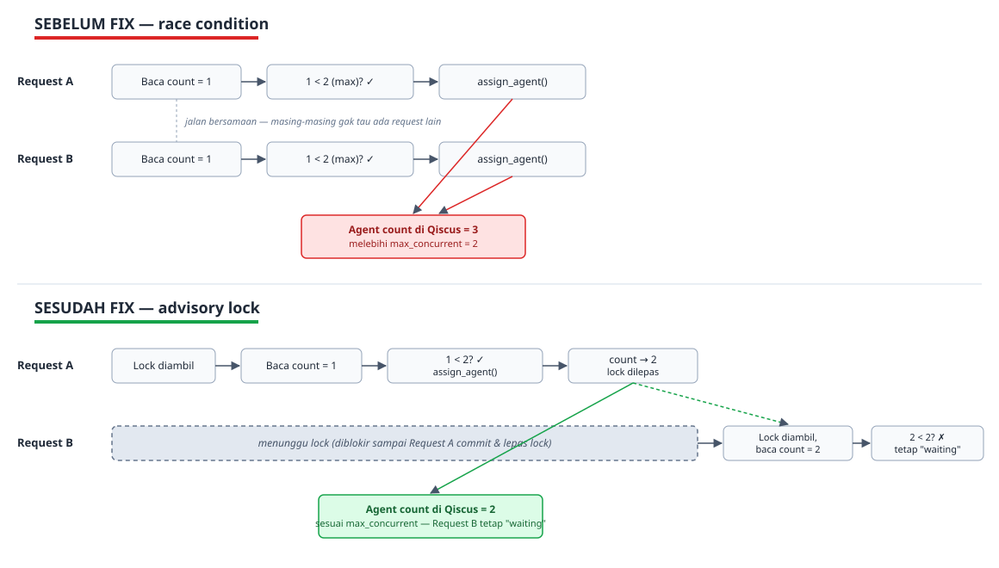

# Status Report — Qiscus Custom Agent Allocation

**App ID:** `xxitg-980tjis6em26fxr` 
**Repository:** https://github.com/AdiPrimanto/qiscus-custom-agent-allocation 
**Periode:** 19–21 Agustus 2026 
**Disusun oleh:** Adi Primanto

---

## Ringkasan Eksekutif

Selama dua hari terakhir, fokus pengembangan ada pada penguatan sisi *reliability* dan *data consistency* dari sistem alokasi agent, setelah sebelumnya ditemukan bug race condition serius saat pengujian beban (20 chat masuk bersamaan ke 2 agent aktif dengan kuota `max_concurrent` masing-masing 2 — total kapasitas semestinya cuma 4 chat — tapi race condition bikin kedua agent itu over-assigned hingga menampung 9 chat). Selain menutup celah race condition tersebut, ditambahkan juga fitur baru untuk menangani agent yang tiba-tiba offline di tengah chat, serta beberapa perbaikan pada observability (logging) supaya tim lebih cepat mendiagnosis masalah production ke depannya. Sistem saat ini sudah lebih stabil dibanding baseline awal; masih ada satu isu open yang sedang diinvestigasi terkait respons 400 dari API Qiscus saat reassign agent (lihat bagian 6).

---

## 1. Perbaikan Race Condition & Konsistensi Data Alokasi

### 1.1 Over-assignment saat traffic bersamaan
Ditemukan lewat load test: beberapa request alokasi yang datang bersamaan bisa membaca data "jumlah chat aktif" agent yang sama-sama masih basi (belum ter-update), sehingga satu agent bisa menerima chat jauh melebihi kuota (`max_concurrent`) miliknya. Diperbaiki dengan mengunci proses alokasi memakai advisory lock di database, sehingga request yang datang bersamaan diproses satu per satu, bukan berebutan.

### 1.2 Room ter-assign dobel saat siklus reconcile tumpang tindih
Proses reconcile (yang mengambil ulang chat yang masih antre) berjalan tiap beberapa detik. Kalau satu siklus reconcile berjalan lambat (misalnya lagi memproses antrean panjang), siklus berikutnya bisa mulai sebelum siklus sebelumnya selesai, dan keduanya bisa memproses room yang sama secara bersamaan — hasilnya satu room bisa "direbut" dari satu agent ke agent lain tanpa disadari. Diperbaiki dengan mengecek ulang status room tepat sebelum commit, di dalam lock yang sama.

### 1.3 Transaksi database mudah timeout saat traffic tinggi
Setelah fix di atas diterapkan, muncul efek samping: saat ada lonjakan ~20 chat sekaligus, request yang antre menunggu giliran lock bisa melebihi batas waktu transaksi, dan karena semua proses ada dalam satu transaksi, kegagalan satu room membatalkan seluruh batch. Diperbaiki dengan memperbesar batas waktu transaksi dan mengisolasi setiap room dalam try/catch sendiri, sehingga satu room gagal tidak lagi menjatuhkan room lain — room yang gagal cukup menunggu siklus reconcile berikutnya.

### 1.4 Room baru hilang tanpa jejak saat proses alokasi error
Sebelumnya, pembuatan data room baru dan proses pencarian agent-nya digabung dalam satu transaksi. Kalau proses pencarian agent gagal (misalnya API Qiscus error), seluruh transaksi di-rollback — termasuk data room itu sendiri — sehingga room tersebut hilang total dari sistem tanpa retry. Diperbaiki dengan memisahkan dua transaksi: data room disimpan dulu secara permanen, baru proses alokasi dicoba terpisah. Kalau alokasi gagal, room tetap tercatat berstatus "menunggu" dan otomatis dicoba lagi di siklus reconcile berikutnya.

*Ilustrasi bug utama (1.1): sebelum fix, dua request alokasi yang datang bersamaan sama-sama membaca kuota agent yang sama (count=1) tanpa saling tahu, sama-sama lolos pengecekan, dan sama-sama berhasil assign — hasil akhirnya agent menampung lebih banyak chat dari kuotanya. Sesudah fix, advisory lock memaksa request kedua menunggu sampai request pertama selesai commit, baru membaca ulang kuota yang sudah ter-update — sehingga pengecekan kuota selalu akurat.*

---

## 2. Fitur Baru

### 2.1 Auto-requeue chat dari agent yang offline
Sebelumnya, kalau seorang agent yang sedang menangani chat tiba-tiba offline (device mati, keluar aplikasi, dsb), chat tersebut tetap "menempel" ke agent itu selamanya — tidak ada mekanisme yang mendeteksi dan mengambil alih. Ditambahkan pengecekan berkala yang membandingkan status agent terhadap status live dari Qiscus; kalau agent terdeteksi offline lebih dari periode toleransi (*grace period*, lihat 5.3), chat-nya otomatis ditarik kembali ke antrean lokal untuk dialokasikan ulang.

> **Catatan:** Bagian "deteksi offline & tarik ke antrean lokal" sudah terverifikasi jalan di production (terkonfirmasi lewat log). Langkah lanjutannya — proses reconcile yang benar-benar meng-assign ulang chat itu ke agent lain di sisi Qiscus — masih ada gap: chat yang sudah ditandai "waiting" di database internal tetap terlihat menempel ke agent offline di tampilan Qiscus. Kemungkinan besar ini gejala dari error 400 `assign_agent` yang lagi diinvestigasi (lihat bagian 6.1) — bukan bug terpisah di fitur ini.

### 2.2 Tooling load testing (JMeter)
Ditambahkan test plan JMeter untuk mensimulasikan lonjakan chat masuk secara bersamaan. Alat ini yang dipakai untuk menemukan bug race condition di bagian 1.1 dan memvalidasi bahwa perbaikannya benar-benar menutup celahnya.

---

## 3. Reliability & Resilience

### 3.1 Retry otomatis saat gagal menandai chat selesai
Saat webhook "mark as resolved" dari Qiscus masuk, sistem menulis ke database untuk menutup room tersebut. Kalau penulisan itu gagal karena gangguan sesaat pada database, sebelumnya tidak ada retry — room tetap tercatat aktif di sistem meski Qiscus sudah menganggapnya selesai, dan kuota agent tetap dianggap terpakai. Ditambahkan retry otomatis (3 kali percobaan) untuk menutup celah ini.

### 3.2 Timeout pada semua pemanggilan API Qiscus
Pemanggilan API ke Qiscus (cek agent tersedia, assign agent) sebelumnya tidak punya batas waktu. Kalau Qiscus lambat merespons (bukan error, hanya diam), proses tersebut bisa menahan lock alokasi tanpa batas waktu — akibatnya seluruh antrean chat ikut macet, bukan cuma satu room yang bermasalah. Ditambahkan timeout 15 detik supaya panggilan yang macet gagal dengan cepat dan melepas lock, bukan membekukan seluruh sistem.

### 3.3 Logging tiap percobaan retry
Sebelumnya, kalau retry mark-as-resolved berhasil di percobaan ke-2 atau ke-3, tidak ada jejak di log bahwa sempat gagal sekali. Sekarang setiap percobaan yang gagal dicatat, sehingga tim bisa memantau seberapa sering gangguan sesaat itu terjadi di production.

---

## 4. Observability — Perbaikan Log Error

### 4.1 Menampilkan isi respons error dari Qiscus
Sebelumnya, saat API Qiscus menolak request (misal HTTP 400), log hanya menampilkan `[Object]` — isi pesan validasi asli dari Qiscus (alasan penolakan) tidak pernah terbaca. Ditambahkan utilitas untuk mengekstrak detail respons (status, url, isi body) sebelum ditulis ke log, dipasang di semua titik yang menangkap error API.

### 4.2 Perbaikan lanjutan: isi body masih terpotong
Setelah fix 4.1 dipasang, ternyata isi body error masih terpotong di log karena `console.error` membatasi kedalaman objek yang ditampilkan, dan body error Qiscus punya struktur bersarang (nested). Diperbaiki dengan mengubah body tersebut menjadi string JSON utuh sebelum dicatat, sehingga isi pesan validasi Qiscus sekarang tampil lengkap di log production.

---

## 5. Data Hygiene & Tuning

### 5.1 Menghapus kolom `customer_identifier` yang tidak terpakai
Setelah diperiksa di seluruh kode, kolom ini (berisi email customer) ternyata hanya ditulis sekali saat assignment dibuat dan tidak pernah dibaca kembali oleh bagian manapun. Karena tergolong data pribadi (PII) yang tidak punya kegunaan nyata, kolom ini dihapus daripada disimpan "untuk jaga-jaga".

### 5.2 Perbaikan contoh query SQL kuota agent
Contoh query di dokumentasi untuk mengecek `max_concurrent` sebelumnya memfilter berdasarkan email agent. Di praktiknya, email tidak unik — agent yang dihapus lalu dibuat ulang di Qiscus bisa mendapat `qiscus_agent_id` baru, tapi baris data lama (dengan email yang sama) tidak ikut terhapus. Query diperbaiki agar memfilter berdasarkan `qiscus_agent_id`, bukan email.

### 5.3 Percepatan deteksi agent offline: 2 menit → 45 detik
Grace period sebelum chat seorang agent offline ditarik kembali (lihat fitur 2.1) semula 2 menit. Nilai ini dipersingkat menjadi 45 detik — masih cukup untuk menghindari salah tarik chat karena koneksi terputus sebentar, tapi bereaksi jauh lebih cepat terhadap agent yang memang benar-benar offline.

### 5.4 Update dokumentasi known limitations
Dokumentasi README diperbarui mengikuti perbaikan-perbaikan di atas, termasuk mencatat secara eksplisit satu celah yang **sengaja belum ditutup**: kondisi langka di mana `assign_agent` berhasil di sisi Qiscus tapi penyimpanan lokal gagal setelahnya, menyebabkan data lokal dan Qiscus tidak sinkron. Keputusan untuk tidak menutup celah ini sekarang didasarkan pada penilaian risiko (kemungkinan kecil, dampak terbatas, self-healing lewat reconcile berikutnya) — bukan karena terlewat.

---

## 6. Isu Prioritas & Saran Perbaikan ke Depan

### 6.1 Sedang diinvestigasi (prioritas)

- **Chat yang sudah berjalan di agent offline gagal dipindahkan ke agent lain (error 400 `assign_agent`):** Direproduksi langsung — satu agent (contoh: punya 2 chat ongoing) ditoggle offline, chat yang sedang dipegangnya dibiarkan (tidak ada aksi lain). Log mengonfirmasi sweep deteksi-offline berjalan benar (chat ditandai "waiting" di database internal setelah grace period), tapi di tampilan Qiscus chat itu tetap terlihat menempel ke agent yang sudah offline, tidak pindah ke agent lain yang online. Log production juga menunjukkan reconcile berulang kali gagal `assign_agent` dengan HTTP 400 untuk room yang sama di jam yang berdekatan — dugaan kuat penyebabnya: penandaan lokal ("waiting") berhasil, tapi langkah lanjutannya (reconcile mencoba assign ulang chat itu ke agent lain lewat API Qiscus) ditolak Qiscus dengan 400, sehingga chat tetap nyangkut di agent yang sudah offline.

  *Catatan scope: ini soal chat yang **sudah berjalan** di agent yang lalu offline — bukan soal chat baru dari customer gagal masuk ke agent yang online; alokasi untuk chat baru (bagian 1) sudah tervalidasi normal lewat load test.* Perbaikan logging (bagian 4) sudah di-deploy supaya body error asli dari Qiscus bisa terbaca; langkah berikutnya adalah mereproduksi ulang kasusnya untuk membaca pesan validasi yang sebenarnya, baru bisa dipastikan akar masalahnya secara pasti.

### 6.2 Saran perbaikan ke depan (bukan prioritas saat ini)

- **Log/metric terpisah untuk langkah reassign-setelah-offline:** Saat ini keberhasilan langkah "reconcile assign ulang chat dari agent offline" tidak punya log/metric sendiri — tercampur dengan log reconcile umum. Menambahkan penanda khusus akan mempercepat diagnosis kalau isu di atas muncul lagi, dan memperjelas apakah gap-nya murni soal error 400 atau ada penyebab lain.
- **Celah desync `assign_agent`** (lihat 5.4): dipantau, belum jadi prioritas perbaikan karena risiko dinilai rendah di skala pemakaian saat ini. Saran ke depan: kalau skala pemakaian bertambah, pertimbangkan outbox/reconciliation job supaya celah ini tertutup permanen.

---

## Status Saat Ini

Sistem sudah melewati serangkaian perbaikan terhadap bug race condition kritikal (over-assignment) dan sudah tervalidasi lewat load testing — ini fokus utama dan sudah selesai. Fitur auto-requeue untuk agent offline sudah aktif di production untuk bagian deteksi & penandaan lokalnya, tapi langkah lanjutannya — memindahkan chat yang sudah berjalan ke agent lain saat agent pemegangnya offline — masih terganjal error 400 `assign_agent` (bukan soal alokasi chat baru, yang sudah tervalidasi normal lewat load test). Observability log sudah diperkuat untuk mempercepat investigasi masalah berikutnya. Error 400 ini jadi satu-satunya isu prioritas yang masih open dan sedang diinvestigasi (lihat bagian 6.1).
